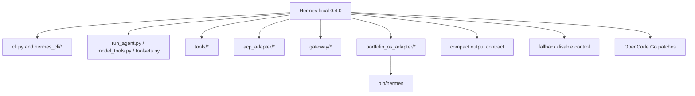
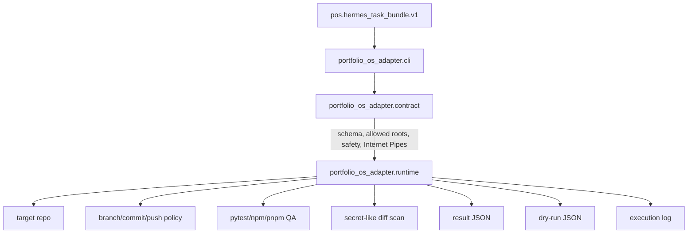
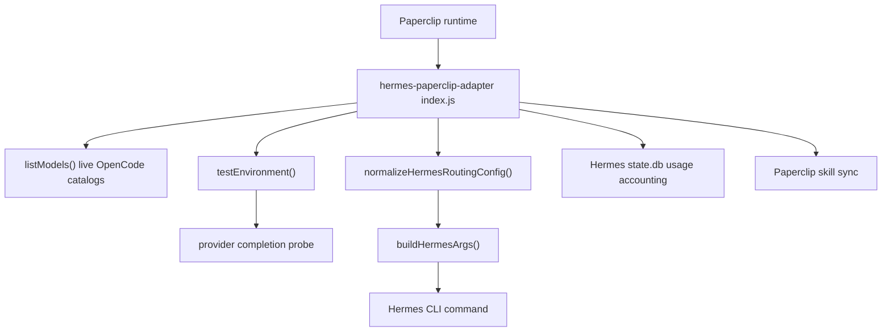
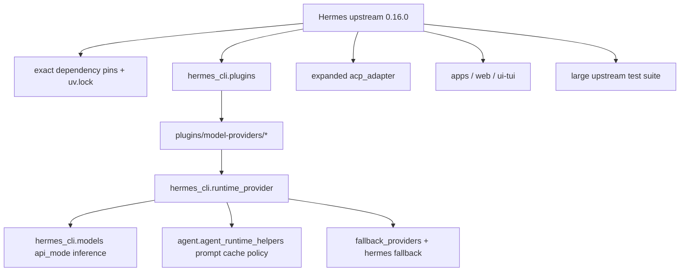

# Hermes Upstream Codebase Inventory - 2026-06-15

## Purpose

This is the explicit local/upstream/delta source map for deciding how to move
the current Hermes/Paperclip implementation onto latest upstream Hermes without
losing Paperclip-specific routing, inference gating, or adapter behavior.

Native Graphify note: the installed `graphify` binary on this host does not
include the full extraction/build pipeline described by the Graphify skill
reference. This inventory uses Graphify-style graph discipline from inspected
sources: git object state, direct file reads, current tests, and the external
Paperclip adapter checkout.

## Version And Tree Baseline

| Item | Current local | Latest fetched upstream |
| --- | --- | --- |
| Ref | `HEAD` / `main` | `upstream/main` |
| Commit | `8bba7a17c263874fa24eb3fa64c507b847ccc0df` | `ae433634db562e644175d39537ef6b811a381f3f` |
| Describe | `v2026.3.23-133-g8bba7a17c` | `v2026.6.5-1033-gae433634d` |
| Package version | `0.4.0` | `0.16.0` |
| Ahead / behind | `8` ahead | `9030` ahead of local |
| Runtime seen locally | `/Users/mnm/.local/bin/hermes` reports `Hermes Agent v0.4.0` | not installed into local env yet |
| Python constraint | `>=3.11` | `>=3.11,<3.14` |

Upstream delta size:

- `5069` files changed.
- `1512833` insertions.
- `97364` deletions.
- Status count by path: `4094 A`, `567 M`, `168 D`, plus renames.

## Top-Level Codebase Shape

Current local tree, largest tracked areas:

| Area | Files | Role |
| --- | ---: | --- |
| `skills` | 380 | bundled skills |
| `tests` | 337 | current fork tests |
| `website` | 113 | docs site |
| `tools` | 60 | tool implementations |
| `optional-skills` | 47 | optional skills |
| `environments` | 43 | execution environments |
| `hermes_cli` | 33 | CLI and config |
| `gateway` | 28 | messaging gateway |
| `agent` | 18 | core agent internals |
| `docs` | 17 | project docs, including Portfolio-OS docs |
| `acp_adapter` | 9 | ACP integration |
| `portfolio_os_adapter` | 4 | local Portfolio-OS task-bundle adapter |

Upstream tree, largest tracked areas:

| Area | Files | Role |
| --- | ---: | --- |
| `tests` | 1556 | much broader regression suite |
| `website` | 727 | expanded docs site |
| `apps` | 571 | new app surfaces |
| `skills` | 452 | expanded bundled skills |
| `optional-skills` | 409 | expanded optional skills |
| `ui-tui` | 358 | new TUI surface |
| `plugins` | 247 | plugin/provider/platform architecture |
| `hermes_cli` | 175 | expanded CLI, config, plugins, fallback, update |
| `web` | 117 | dashboard/web surface |
| `agent` | 116 | refactored runtime helpers and completion flow |
| `tools` | 105 | expanded tools |
| `gateway` | 70 | expanded gateway and adapters |
| `acp_adapter` | 11 | expanded ACP support |
| `providers` | 3 | provider registry support |

Changed-path concentration from local to upstream:

| Area | Changed paths | Cutover meaning |
| --- | ---: | --- |
| `tests` | 1573 | upstream coverage is much broader; old focused tests are insufficient |
| `website` | 713 | docs moved and expanded |
| `apps` | 571 | new upstream surfaces not used by current Paperclip path |
| `optional-skills` | 382 | skill changes should be treated as independent unless Paperclip relies on them |
| `skills` | 367 | skill corpus changes may alter agent behavior if enabled |
| `ui-tui` | 358 | new surface; do not enable for Paperclip cutover unless needed |
| `plugins` | 247 | central upgrade path for providers and Paperclip CLI registration |
| `hermes_cli` | 175 | major CLI/config/fallback/runtime-provider changes |
| `agent` | 116 | major conversation-loop/runtime-helper changes |
| `tools` | 107 | tool behavior changes need normal upstream test coverage |
| `gateway` | 72 | gateway changes not required for first Paperclip cutover |
| `acp_adapter` | 9 | upstream ACP likely supersedes local patch |
| `portfolio_os_adapter` | 4 | deleted by upstream unless ported |

## Local Hermes Fork Map



Local commits not in upstream:

| Commit | Local purpose | Current cutover disposition |
| --- | --- | --- |
| `cb1dd7e30` | OpenCode provider metadata and context guidance | replace with upstream provider profiles |
| `4c100e48f` | fallback model disable control | preserve as Paperclip/external-adapter guard |
| `af7eb5c76` | Portfolio-OS Hermes adapter | port as plugin/command |
| `167e6f3ce` | accept Portfolio-OS namespace in wrapper | replace with upstream plugin CLI registration |
| `9f46017ca` | OpenCode Go Qwen oa-compat alias | mostly replace with upstream, but preserve adapter qwen replacement test |
| `6be74cea6` | ACP auth method schema rename | replace with upstream ACP auth implementation |
| `f0a1f4f12` | compact output budgets | decide global vs Paperclip-local; not upstream-equivalent |
| `8bba7a17c` | Internet Pipes bundle contract | preserve in Paperclip plugin/adapter contract |

Current uncommitted local runtime-provider edits:

- `.gitignore` adds `*.key`.
- `hermes_cli/runtime_provider.py` prevents stale configured `api_mode` from
  leaking to a different requested provider.
- `tests/test_runtime_provider_resolution.py` adds a MiniMax stale-api-mode
  regression.

Upstream has a broader equivalent in
`hermes_cli/runtime_provider.py::_provider_supports_explicit_api_mode()` and
special OpenCode mode derivation. The MiniMax-specific regression should still
be preserved or re-added.

## Local Portfolio-OS Adapter Map



Contract behaviors that must not regress:

- `validate-bundle`, `dry-run`, `dispatch`, `status`, `resume`.
- `pos.hermes_task_bundle.v1` schema.
- Allowed-root enforcement under `/Users/mnm/Documents/Github`, `/tmp`,
  `/private/tmp`, plus `HERMES_PORTFOLIO_OS_ALLOWED_ROOTS`.
- `launch_execution` requires Internet Pipes readiness `alpha_ready` or
  `factory_ready` with no missing stations.
- `evidence.internet_pipes` must match `opportunity.internet_pipes`.
- Destructive operations are forbidden before target repo mutation.
- `write_policy.local_only` and `push_policy.no_push` cannot conflict with push
  or PR intent.
- Secrets scan blocks commit when staged diffs look credential-like.
- Result artifacts include Paperclip execution id, issue ids, and GStack
  artifact pointers.

Direct upstream merge deletes this package and `bin/hermes`.

## External Paperclip Adapter Map

The cockpit has an installed external adapter:

```text
/Users/mnm/Documents/Github/hermes-paperclip-adapter
type=hermes_local
version=0.1.0
registered in /Users/mnm/Documents/Github/.paperclip/portfolio-os-cockpit/adapter-plugins.json
```



External adapter behaviors that must not regress:

- Adapter type remains `hermes_local`.
- Default command currently points at
  `/Users/mnm/Documents/Github/hermes-agent/venv/bin/hermes`.
- Hermes invocation is `hermes chat -Q -q <prompt> --source paperclip`.
- `disableFallbackModel` defaults true and emits
  `--disable-fallback-model` plus `HERMES_DISABLE_FALLBACK_MODEL=1`.
- Provider/model routing infers `opencode-go` or `opencode-zen` from selected
  model IDs when provider is `auto`.
- `qwen3.7-max` is mapped to `deepseek-v4-pro` because Hermes/OpenCode Go
  oa-compat does not safely support that model.
- Live model discovery checks:
  `https://opencode.ai/zen/go/v1/models` and
  `https://opencode.ai/zen/v1/models`.
- Required OpenCode Go models: `deepseek-v4-pro`, `deepseek-v4-flash`.
- Required OpenCode Zen free fallback model: `deepseek-v4-flash-free`.
- `testEnvironment()` runs command existence, `--version`, `doctor`,
  `acp --help`, OpenCode model checks, and selected provider completion probe.
- Completion probe failures mark the provider degraded before spawning a real
  Hermes run.
- Usage accounting reads Hermes `state.db` and treats OpenCode usage/cost as
  pending-confidence unless reliable provider telemetry exists.
- Prompt context keeps Internet Pipes projected into the prompt before noisy
  context truncation.

This external adapter is not part of upstream Hermes, so upstream cannot
replace it. The cutover must update its command path/config and tests if the
new Hermes environment moves away from the old venv.

## Upstream Hermes Map



Upstream areas that are real upgrades:

- Provider profiles for MiniMax, MiniMax CN, MiniMax OAuth, OpenCode Zen,
  OpenCode Go, OpenRouter, Qwen OAuth, Kimi, Z.ai, DeepSeek, Gemini, Anthropic,
  Bedrock, Azure Foundry, and others.
- OpenCode Go has model-specific API mode, reasoning, and max-token handling.
- MiniMax uses Anthropic-compatible defaults and has M3 OpenAI-compatible
  reasoning controls.
- Prompt-cache policy explicitly includes MiniMax Anthropic-compatible routes
  and Qwen/Alibaba-family OpenCode routes.
- Stale `api_mode` / `base_url` leakage is handled centrally.
- `fallback_providers` supports ordered fallback across more entrypoints.
- Plugin CLI command registration can carry Paperclip commands without core
  parser patches.
- ACP is more complete than the local schema-rename compatibility patch.
- Packaging has exact pins and a Python `<3.14` ceiling to avoid resolver/source
  build failures.

Upstream areas that are new but not required for Paperclip cutover:

- `apps`, `web`, `ui-tui`, expanded gateway/platform plugins, dashboard assets,
  and many optional skills.
- These should stay disabled or unselected during the first Paperclip cutover
  unless a specific operational need is proven.

## Delta Classification

| Area | Classification | Why | Safe action |
| --- | --- | --- | --- |
| Provider runtime core | Upgrade | upstream has broader, official provider profiles and stale-mode guards | adopt upstream; port exact MiniMax/OpenCode regressions |
| MiniMax support | Upgrade with guard | upstream provider is stronger, but generic fallback can overrun Paperclip policy | adopt provider; enforce Paperclip hard stop after MiniMax |
| OpenCode Go support | Upgrade with alias caveat | upstream handles more models and api modes; external adapter has qwen replacement contract | adopt upstream; keep adapter qwen replacement tests |
| `fallback_providers` | Mixed | richer than local, dangerous if it reaches paid tiers automatically | use only through Paperclip policy gate |
| `--disable-fallback-model` | Break risk | external adapter depends on this CLI flag/env behavior | port flag/env behavior or update adapter to equivalent upstream config |
| Portfolio-OS adapter | Break risk | upstream deletes it | port as plugin CLI command |
| External Paperclip adapter | Break risk | not in Hermes upstream; command path and CLI flags may drift | run its npm tests and update config/path after Hermes cutover |
| Internet Pipes contract | Not upstream | no equivalent upstream feature | preserve unchanged in adapter/plugin |
| Result artifacts | Not upstream | no equivalent upstream schema | preserve with golden tests |
| Inference preflight | Partial upgrade | external adapter has completion probe; upstream has provider resolution | keep external probe; add Paperclip plugin pre-dispatch check |
| Adapter pause on failure | Not upstream | upstream fallback is not a Paperclip scheduler pause | keep/add explicit blocked-result and pause signal |
| ACP | Upgrade | upstream supersedes local compatibility patch | adopt upstream and smoke local clients |
| Output compacting | Mixed | upstream has provider token caps, not local response compaction | decide whether to keep global or make Paperclip-local |
| Packaging | Upgrade with rollout risk | upstream exact pins are better, old venv lacks pip | build fresh env; do not mutate old venv |
| Gateway/platform adapters | Likely not impacted if disabled | Paperclip path is external adapter + CLI, not upstream gateway | keep disabled first; verify no port/process collisions |
| Skills | Potential behavior change | expanded skill corpus may affect agents if enabled | preserve Paperclip skill sync and run agent canaries |
| Existing Paperclip cockpit plugin config | Not impacted by git merge, impacted by env path | lives outside Hermes repo | update only after new Hermes command path passes checks |

## Areas That Look Like Upgrades But Can Lose Behavior

1. `fallback_providers`

Upstream fallback is a platform upgrade, but Paperclip cannot accept automatic
post-MiniMax escalation. The external adapter currently disables Hermes
fallback by default, and Paperclip owns degraded routing. If upstream fallback is
enabled blindly, a selected OpenCode Go or MiniMax lane can silently continue
into OpenAI, Claude, Gemini, or OpenRouter. That would violate the hard gate.

2. Plugin CLI registration

Upstream plugin CLI registration is the right long-term home for
`hermes portfolio-os`, but standalone plugins are opt-in. If the plugin is not
enabled or bundled correctly, the command disappears even though Hermes itself
starts successfully.

3. Provider profiles

Upstream OpenCode/MiniMax profiles are better than local patches, but model
names and transport choices may differ. The external adapter's
`qwen3.7-max -> deepseek-v4-pro` replacement and required-model checks must
remain until upstream and OpenCode Go prove qwen oa-compat is safe.

4. Packaging

Upstream packaging is safer, but the local Paperclip adapter's default command
points at the old Hermes venv. A fresh upstream environment is correct; a silent
path mismatch is a production break.

5. ACP

Upstream ACP is better, but Paperclip's current adapter contract is
request/run-oriented over `hermes chat`. ACP should be smoke-tested but not made
the first production integration path unless the external adapter is changed
deliberately.

6. Output/token handling

Upstream request-level token handling is broader. It does not preserve the
local compact-response contract. If Paperclip relies on compact operator
responses or bounded result text, keep that shaping at the adapter boundary.

## Safe Cutover Plan

1. Branch from `upstream/main`; do not merge upstream into current `main`.
2. Build a fresh upstream environment with upstream dependency rules.
3. Port the Python `portfolio_os_adapter` into an upstream-style plugin that
   registers `portfolio-os` with `ctx.register_cli_command`.
4. Preserve the command surface:
   `validate-bundle`, `dry-run`, `dispatch`, `status`, `resume`.
5. Preserve bundle schema, Internet Pipes gates, allowed roots, destructive-op
   refusal, push policy, secret scan, QA capture, result JSON, and execution log.
6. Preserve or replace `--disable-fallback-model` with an equivalent upstream
   policy switch that the external adapter can use.
7. Adopt upstream provider runtime for MiniMax and OpenCode Go.
8. Add Paperclip-specific fallback tests proving:
   primary failure may try MiniMax, MiniMax failure writes blocked result,
   paid-provider escalation is denied without approval, and approval is logged.
9. Add inference preflight before adapter dispatch:
   provider resolution, credential presence, optional completion probe, and no
   target repo mutation before preflight passes.
10. Update `/Users/mnm/Documents/Github/hermes-paperclip-adapter` config/tests
    only after the new Hermes command path is stable.
11. Run test layers:
    upstream runtime/provider tests, Paperclip plugin tests, external adapter
    `npm test`, ACP smoke, full non-integration suite.
12. Run live canary:
    fixture validation, dry-run, disposable dispatch, real low-risk no-push
    dispatch, external adapter `testEnvironment()`, Paperclip guard.
13. Switch Paperclip's adapter command path only after canary passes.
14. Roll back immediately on missing command, invalid result schema,
    unauthorized provider attempt, failed inference preflight, or guard failure.
