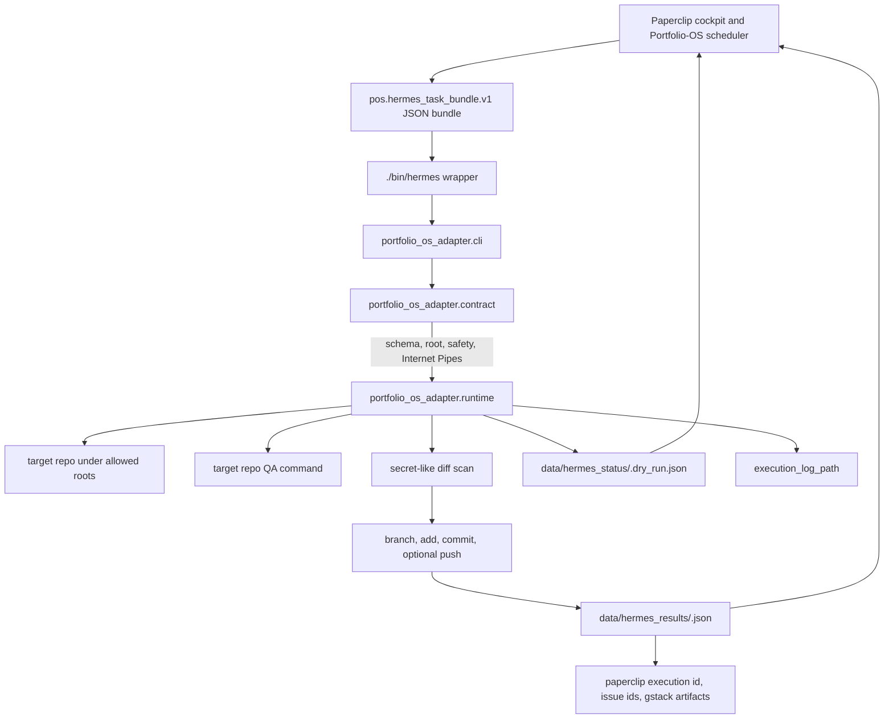
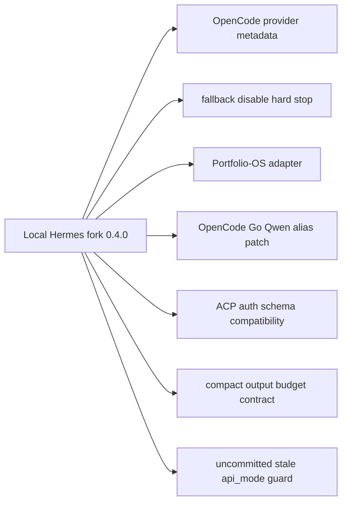
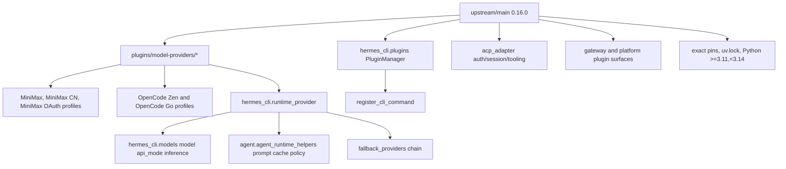
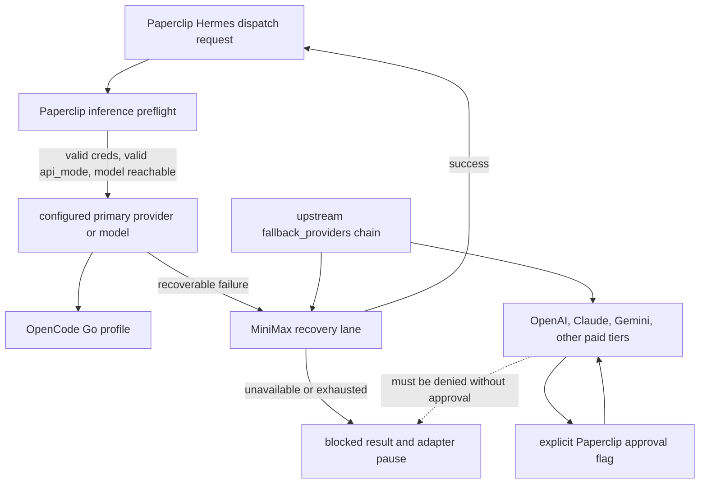
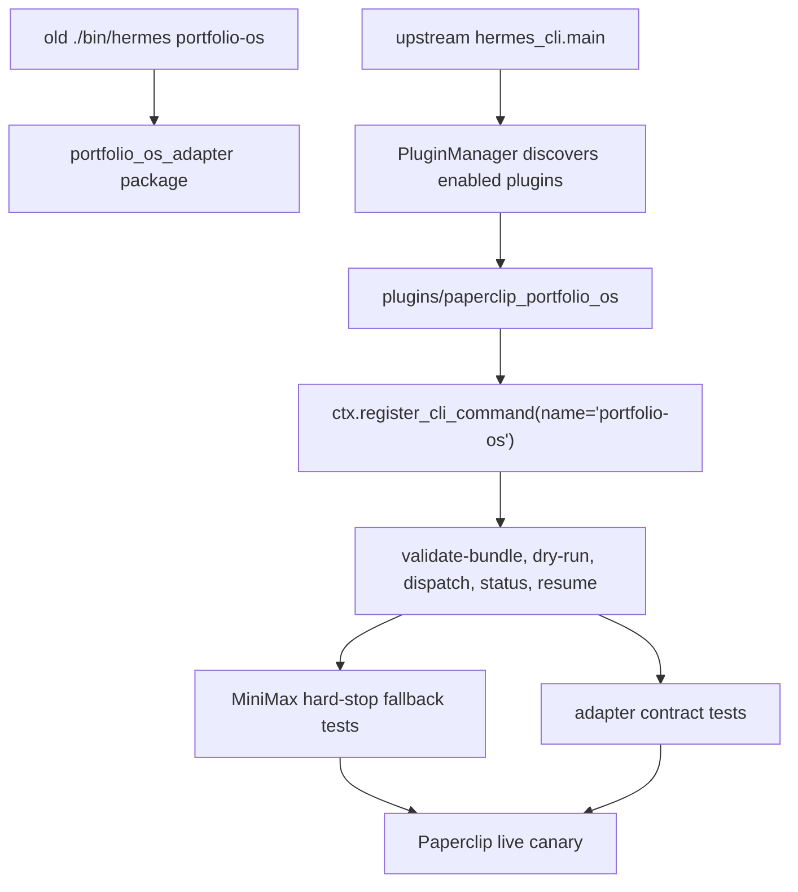
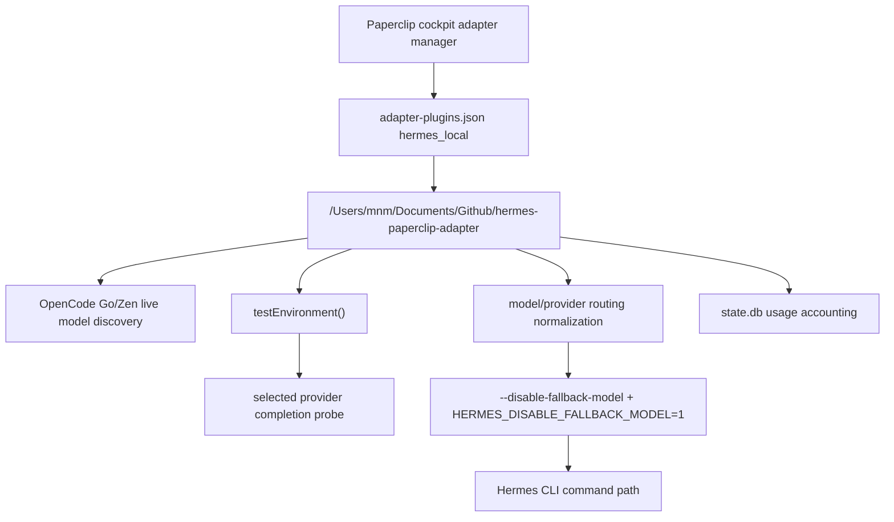

# Hermes Upstream Cutover Graphs - 2026-06-15

## Scope

This file maps the current Hermes Agent fork, the fetched upstream Hermes
runtime, and the Paperclip/Portfolio-OS adapter cutover path.

Native Graphify note: the installed `graphify` binary on this host currently
exposes query/install/hook commands only, not the full extraction pipeline in
the Graphify skill reference. These maps are therefore Graphify-style manual
maps built from fetched git state, direct file reads, and current test output.
No synthetic edge below is presented as native Graphify output.

## Evidence Coordinates

- Local checkout: `main` at `8bba7a17c`.
- Upstream checkout: `upstream/main` at `ae433634d`.
- Branch delta: `8` local commits ahead, `9030` upstream commits behind.
- Local package version: `0.4.0`.
- Upstream package version: `0.16.0`.
- Focused local tests: `tests/test_runtime_provider_resolution.py` and
  `tests/test_portfolio_os_adapter.py` passed with `46 passed`.
- Local adapter command: `./bin/hermes portfolio-os`.
- Upstream deletion forecast: `HEAD..upstream/main` deletes `bin/hermes`,
  `portfolio_os_adapter/*`, and existing `docs/portfolio_os/*` unless they are
  explicitly reintroduced.

## Current Runtime And Adapter Map

Meaning: the current adapter is a safety and artifact boundary, not just a
terminal shortcut. The cutover must preserve the bundle contract, allowed-root
guard, Internet Pipes readiness checks, push policy, forbidden-operation checks,
secrets scan, QA result capture, and Paperclip result schema.

## Current Local Patch Map

Decision overlay:

- Replace with upstream: OpenCode provider metadata, OpenCode Go model routing,
  ACP auth compatibility, stale `api_mode` guard.
- Preserve and port: Portfolio-OS adapter, Internet Pipes bundle contract,
  Paperclip result artifacts, fallback hard-stop policy.
- Decide placement: compact output budget contract. Global behavior is not
  present upstream; Paperclip-local output shaping is lower risk than changing
  upstream's global conversation loop.

## Upstream Runtime Map

Meaning: upstream has stronger provider infrastructure than the fork. The safe
strategy is to adopt upstream core and re-port Paperclip as an upstream-style
plugin instead of carrying an old core fork.

## Provider And Fallback Risk Map

Required cutover behavior: upstream may support broad fallback chains, but the
Paperclip adapter must impose a hard boundary. After MiniMax exhaustion the
adapter should write an auditable blocked result and pause the Paperclip/Hermes
execution lane rather than continuing into OpenAI, Claude, Gemini, or another
paid provider without explicit approval.

## Adapter Re-Home Map

Porting target: create a Paperclip/Portfolio-OS plugin that registers the same
operator command surface through `ctx.register_cli_command`. The plugin must be
enabled or bundled explicitly because upstream standalone plugins are opt-in by
default.

## External Paperclip Adapter Map

Meaning: the Paperclip cutover has an external JavaScript adapter as well as
the Python Portfolio-OS adapter inside this repo. Upstream Hermes does not own
that adapter. The new Hermes environment must either preserve its current CLI
contract (`hermes chat`, `--disable-fallback-model`, provider/model flags) or
the adapter must be updated and tested before the cockpit command path is
switched.

## Cutover Validation Graph

```mermaid
flowchart LR
    branch["new branch from upstream/main"]
    env["fresh upstream env via uv or upstream install path"]
    port["port Paperclip plugin"]
    unit["unit and contract tests"]
    provider["provider routing tests"]
    fallback["fallback hard-stop tests"]
    external["external adapter npm test"]
    acp["ACP smoke tests"]
    adapter["adapter dry-run and dispatch tests"]
    cockpit["Paperclip guard and canary"]
    switch["production path switch"]
    rollback["rollback to current main and venv"]

    branch --> env
    env --> port
    port --> unit
    unit --> provider
    provider --> fallback
    fallback --> external
    external --> acp
    acp --> adapter
    adapter --> cockpit
    cockpit --> switch
    switch --> rollback
```

Hard stops:

- `hermes portfolio-os` is missing.
- A valid `pos.hermes_task_bundle.v1` fixture fails validation.
- Any launch bundle with missing Internet Pipes stations dispatches.
- MiniMax exhaustion continues into OpenAI, Claude, Gemini, or another paid
  provider without explicit approval.
- Result JSON or execution log schema differs from Paperclip's expected
  contract.
- Paperclip cockpit guard fails after the path switch.
